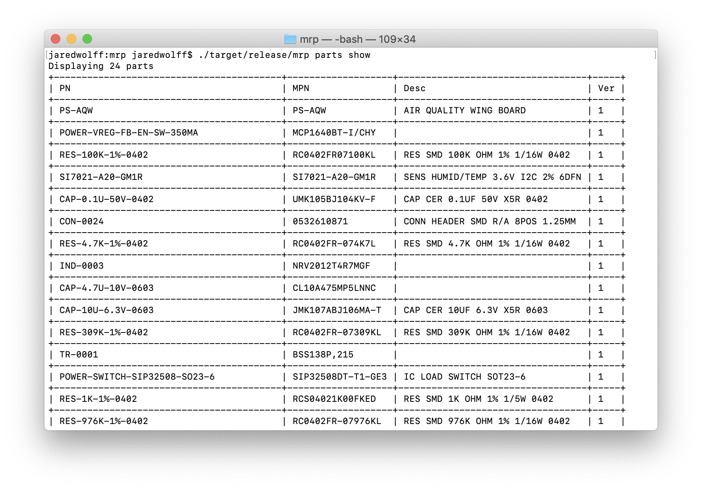
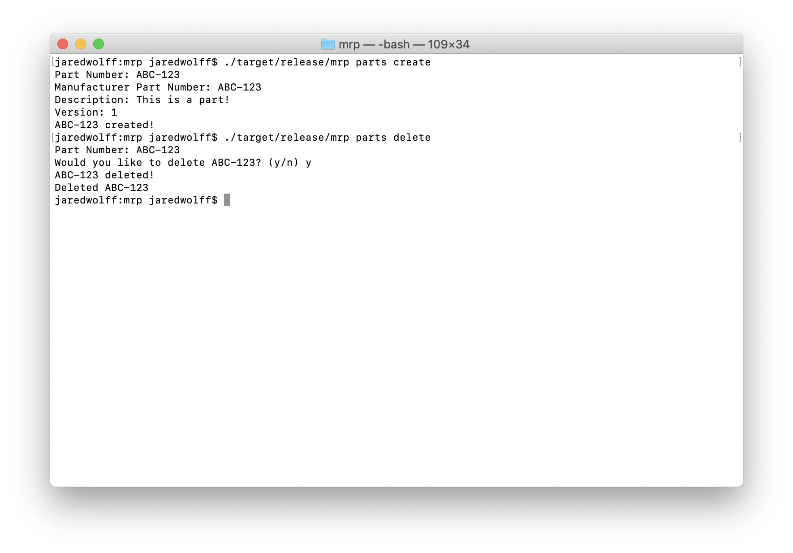
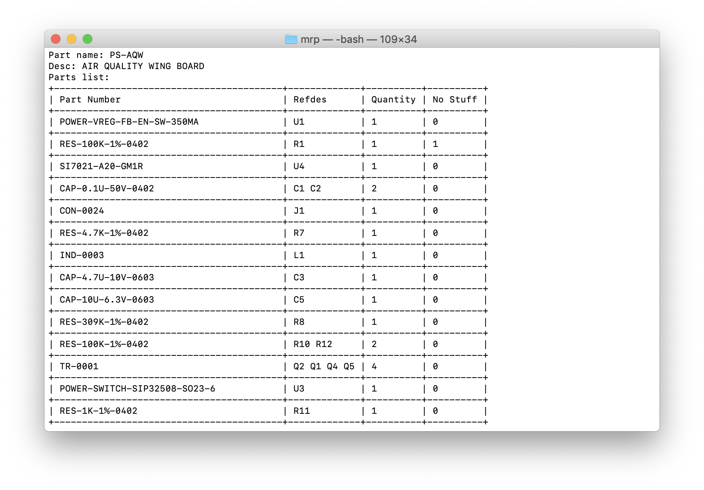
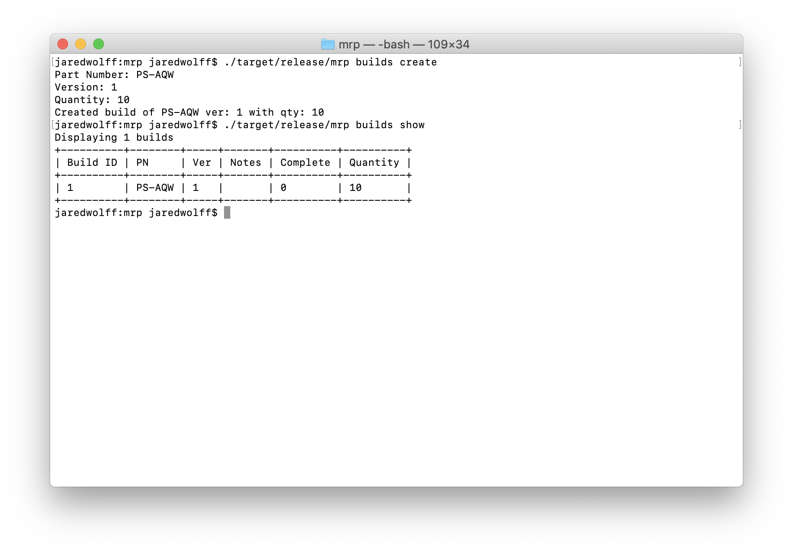
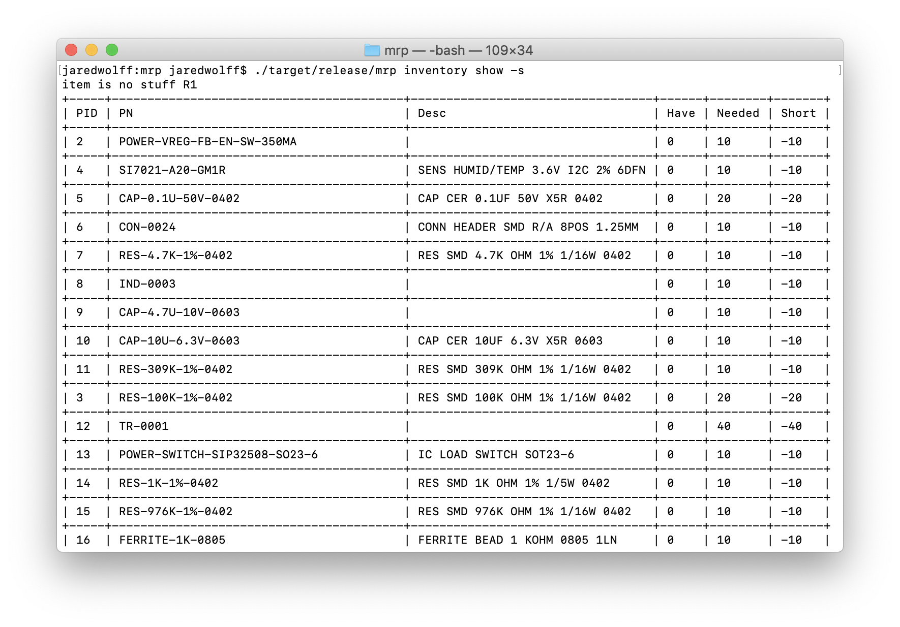
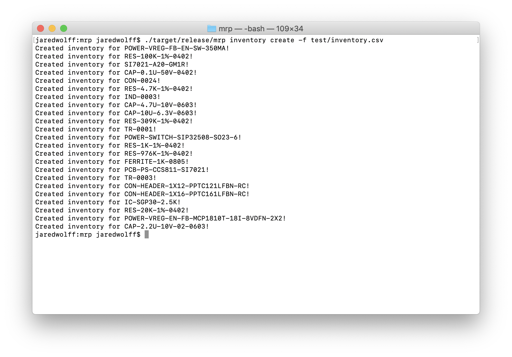
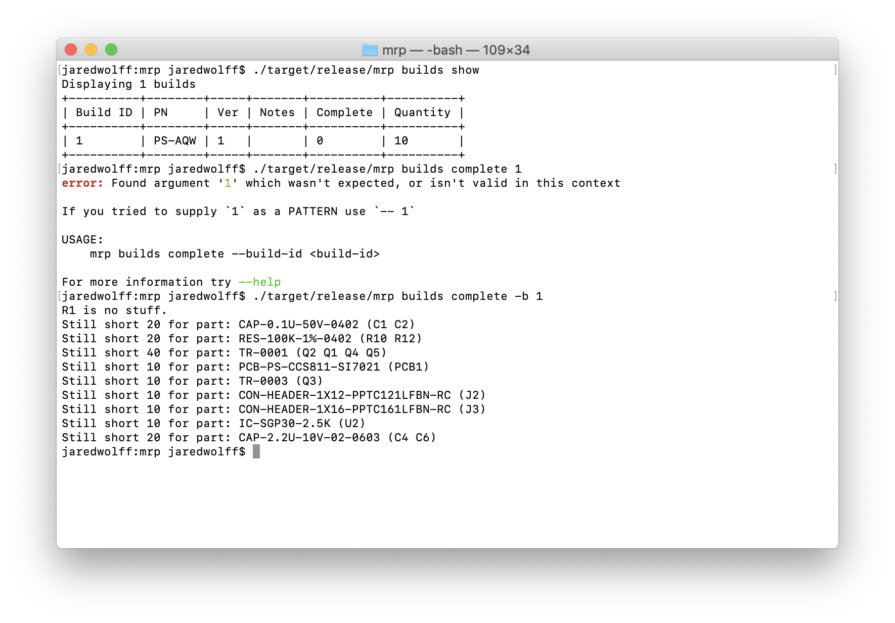

# An Eagle Powered Bom Management for your command line!


This project utilizes the built-in capabilities of Eagle to store part data. Use this project to
capture your bill of materials. Use it to track inventories. Use it to create builds and
consume inventory accordingly! It's not meant to replace PLM (Product Lifecycle Management) systems
like [Aligni](https://www.aligni.com) but rather supplement product makers who may not be able to pay for it.
(By the way, [Aligni](https://www.aligni.com) is *free* for open source projects!)

## Functionality

### Create/Delete Parts

Using `mrp parts create` and `mrp parts delete` you can easily add and remove parts.



### Add a Bill of Materials from an Eagle .sch

Creating parts manually is a pain though. Why not add them using an EagleCAD schematic!

`mrp bom import -f ~/Documents/eagle/projects/pm25/pm25.sch`



### Create a Build

You can then create a new "build" based on a BOM. In my case my BOM part number is `PS-AQW`:



### Check shortages

You can also check shortages using `mrp inventory show -s` Without the `-s` argument, this command will show all your inventory.



### Add Inventory from CSV

If you have inventory, you can track it here! You can add inventory one by one or use a .csv file to do the work. This is great for importing Digikey purchases, etc.



### Complete a Build

Finally you can check your shortages and then complete your build. Use `mrp build complete -b <your build  id>` to finish up. This command will double check your inventory is up to snuff before completing your build though!



## This Utility Is Alpha

And it never may make it out of Alpha. Use at your own risk.

## Building

To build run `cargo build --release`. The release will be placed in `target/release`. As of this writing
the bin is called `mrp`.

## .env file

You do need an `.env` file. You should define your DB name/location and also the database you're using inside your schematic.

Example:

```
DATABASE_URL=./database.db
DEFAULT_LIBRARY_NAME=wolff-den
```

If you have parts distributed across many libraries, this solution will not work for you.

## Migrations

`diesel migration run` to get to the latest
`diesel migration revert` to roll back

## Roadmap

* [ ] Tests
* [x] Import a BOM from a .sch file
* [x] Adds/updates parts to DB from BOM import.
* [x] Create BOM relationships
* [x] Create a build based on a BOM
* [x] Check shortages based on inventory
* [x] Add inventory from CSV
* [ ] Update inventory from CSV
* [ ] Update a exiting inventory item
* [x] Complete a build and consume inventory
* [x] Unified binary
* [x] Import inventory fails without unit_price column and notes column
* [x] Creating inventory includes price
* [x] Updating BOM version makes the old one inaccessible
* [x] Create the idea of a part "alias". Whereas a part is simply an alias of another part. Could be multiple quantities too with MQTY.
* [ ] Delete a version of a bom
* [ ] Alternates +
* [ ] Part substitutions
* [ ] Searching for parts
* [ ] Importing purchase (shortage check only)
* [x] `bom show` without `-v` shows latest
* [x] Exporting shortage list to CSV for easy purchases
* [ ] Integration of Digikeypn
* [ ] Documentation

## Handy URLS

* <https://github.com/tafia/quick-xml>
* <https://www.techiediaries.com/sqlite-create-table-foreign-key-relationships/>

## Steps for testing

```
cargo run --bin mrp bom import -f /Users/jaredwolff/Documents/eagle/projects/pm25/pm25.sch
cargo run --bin mrp build create
cargo run --bin mrp inventory show -s
cargo run --bin mrp inventory create -f test/inventory.csv
cargo run --bin mrp inventory show -s
cargo run --bin mrp inventory show
cargo run --bin mrp build show -a
cargo run --bin mrp build complete -b 1
```

## License

BSD-3 Licensed 🎉
